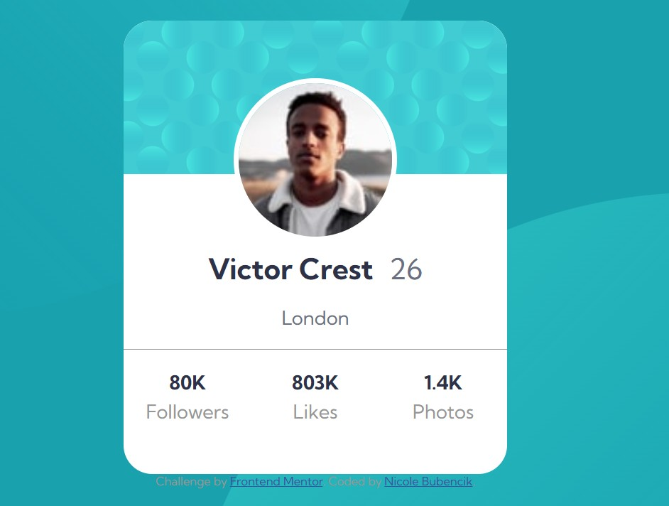

# Frontend Mentor - Profile card component solution

This is a solution to the [Profile card component challenge on Frontend Mentor](https://www.frontendmentor.io/challenges/profile-card-component-cfArpWshJ). Frontend Mentor challenges help you improve your coding skills by building realistic projects. 

## Table of contents

- [Overview](#overview)
  - [The challenge](#the-challenge)
  - [Screenshot](#screenshot)
  - [Links](#links)
- [My process](#my-process)
  - [Built with](#built-with)
  - [What I learned](#what-i-learned)
  
## Overview

### The challenge

Build a responsive profile card component that matches the provided design as closely as possible, using HTML and CSS. The goal was to focus on layout, styling, and positioning elements like background images and a profile picture overlap.

### Screenshot

### Links

- [Solution URL](https://github.com/nikkiBubencik/profile-card-component-main)
- [Live Site URL](https://nikkibubencik.github.io/profile-card-component-main/)

## My process

### Built with

- Semantic HTML5 markup
- CSS custom properties
- Flexbox
- CSS Grid
- Mobile-first workflow

### What I learned

Through this challenge, I gained a better understanding of CSS positioning (absolute, relative), z-index, and background image placement. I also practiced using custom properties, flexbox, and grid to structure the layout effectively. It was a great exercise in creating a clean, responsive component using only HTML and CSS.

